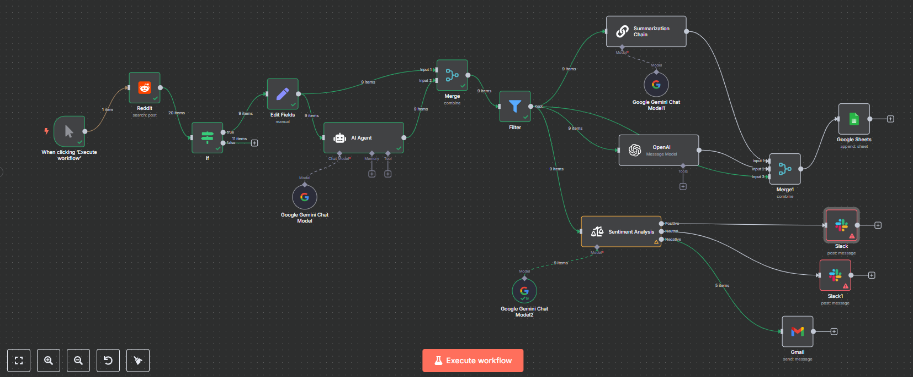

# 🚀 Business Ideas from Reddit Posts

Automatically extract, filter, and analyze startup/business ideas from Reddit — complete with AI summarization, sentiment tagging, and real-time alerts via Slack and Gmail.

---

## 🧠 Overview

This workflow scans Reddit for posts containing potential business problems or startup discussions. It filters the noise using AI agents and sentiment models, summarizes the core idea, and sends alerts based on emotional tone.

---

## ⚙️ Flow Summary

1. **⚡ Manual Trigger**  
   Click to run anytime — no schedule required.

2. **🔍 Reddit Scraper**  
   Fetches 20 posts from relevant subreddits (e.g. r/startups, r/smallbusiness).

3. **🧠 AI Filtering Agent**  
   Checks if each post is genuinely a business problem/idea using a Google Gemini LLM.

4. **✍️ Manual Edit (Optional)**  
   Adjust extracted fields if needed for clarity.

5. **💡 AI Agent (Gemini)**  
   Extracts the business idea or pain point and reframes it cleanly.

6. **🔗 Merge and Filter**  
   Combines processed content and filters based on your rules.

7. **📄 Summarization + Title (Gemini)**  
   Uses a Gemini chain to craft a clean summary and idea title.

8. **📊 Sentiment Analysis**  
   Tags the post’s tone as Positive, Neutral, or Negative using a second Gemini model.

9. **📁 Google Sheets Logging**  
   Saves the result with all tags and metadata for tracking and insights.

10. **🔔 Slack + Gmail Alerts**  
    - 📈 Positive or neutral ideas → Posted to Slack.
    - ❗ Negative (problem-heavy) posts → Sent to Gmail for deeper review.

---

## 🔍 Key Integrations

- **🧠 Google Gemini Chat Models**  
  For idea extraction, summarization, and sentiment tagging.

- **🌐 Reddit API**  
  Real-time scraping of startup-related discussions.

- **📊 Google Sheets**  
  Structured logging of all processed insights.

- **🔔 Slack & Gmail**  
  For live alerts and follow-ups.

---

## 💡 Use Cases

- 📬 Curate weekly newsletters of trending startup ideas  
- 📈 Feed early-stage accelerators or incubators with fresh concepts  
- 🔎 Track emerging pain points for product-market fit research  
- 📚 Academic insight into entrepreneur sentiment

---

## 🧩 Stack

- **n8n** – Workflow engine  
- **Reddit** – Source of crowdsourced innovation  
- **Google Gemini + OpenAI** – Dual-model LLM insights  
- **Slack + Gmail** – Real-time alerting  
- **Google Sheets** – Data storage

---

## 🧠 Smart Features

- ❓ AI-Powered Post Validation  
- 🧠 Multi-model Reasoning (OpenAI + Gemini)  
- 🧵 Summarization Chain for digestible output  
- ❤️ Emotion-aware Routing  
- 📊 Data logging for trend tracking

---

 