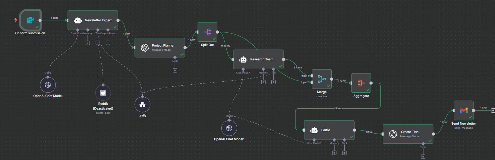
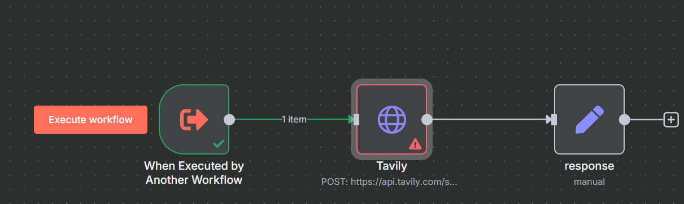

# 🗞️ Newspaper Automation Workflow

Automate the entire newsletter creation pipeline — from form input to AI research, editing, and Gmail delivery — using n8n, OpenAI, and Tavily.

---

## 🧠 Overview

This workflow auto-generates and sends AI-crafted newsletters based on user-submitted topics. It orchestrates multiple agents for planning, research, writing, and titling — making it a smart, self-running content machine.

---

## ⚙️ How It Works

1. **📝 Form Trigger**  
   Kicks off the workflow on user topic submission.

2. **🧑‍💼 Newsletter Expert**  
   Parses user intent and defines content requirements.

3. **🧠 Project Planner (GPT)**  
   Breaks down the newsletter into research subtopics.

4. **📦 Split & Delegate**  
   Splits subtopics and delegates them to the **Research Team**.

5. **🌐 Subworkflow: Tavily Web Search**  
   Uses Tavily API for fast, clean, and relevant web results.  
   *(See subworkflow below)*

6. **📚 Merge + Aggregate**  
   Consolidates all research into one coherent block.

7. **🖋️ Editor Agent**  
   Polishes the draft using AI editing skills.

8. **🏷️ Title Generator**  
   Creates an engaging subject line for the newsletter.

9. **📨 Gmail Integration**  
   Sends the final newsletter directly via Gmail.

---

## 🔎 Subworkflow: Tavily Search Integration

> **Function:** This modular subflow takes research prompts from the main flow and queries the [Tavily Search API](https://api.tavily.com/) to retrieve real-time, high-quality results.

---

## 🚀 Features

- 🔗 Tavily Web Research Integration  
- 💬 LLM-powered Agents (OpenAI GPT-4)  
- 🧠 Modular Memory + Tool Use  
- 📥 Form-to-Gmail Automation  
- 🧩 Fully Extensible Subworkflows

---

## 💡 Use Cases

- AI-generated newsletters
- Automated topic-based briefings
- Content creation assistants
- Academic research digests

---

## 🧩 Stack

- **n8n** – Workflow Orchestration  
- **OpenAI Chat Models** – Planning, Editing, Titling  
- **Tavily** – Real-time Search API  
- **Gmail** – Final Delivery  
- **Forms** – Trigger Input

---

 