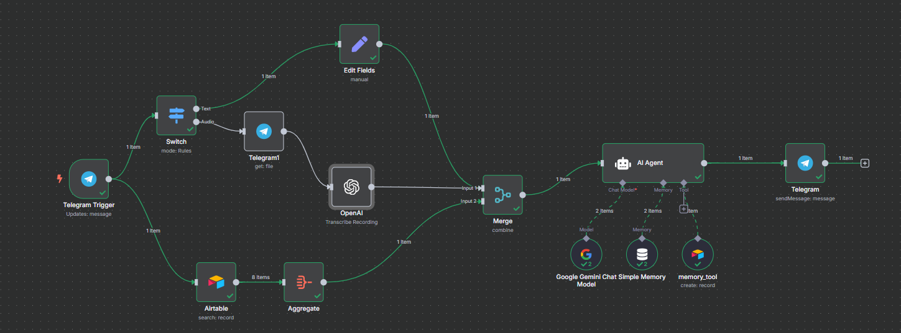

# 🧠 Self-Learning Memory Agent

### 🤖 Description
An intelligent Telegram bot that listens to your text or voice messages, understands them using AI, and keeps getting smarter by saving relevant memory—like your personal assistant with a brain.

### 🔧 Tools Used
- Telegram (Trigger, File Fetch, Response)
- OpenAI (Whisper for Transcription)
- Airtable (Search + Aggregate Context)
- Google Gemini Chat Model
- Custom Memory Tool
- n8n AI Agent Node

### ⚙️ How It Works
1. User sends a text or voice message on Telegram.
2. If it's voice, it gets transcribed using OpenAI Whisper.
3. Relevant context is pulled from Airtable and merged.
4. Gemini generates a smart reply with memory support.
5. Memory tool logs key insights for future interactions.
6. Response is sent back via Telegram.

### 🚀 Use Case
Build a Telegram bot that *learns you* over time—perfect for journaling, habit tracking, smart reminders, or just fun conversations.

### 🖼 Workflow Preview

### 📥 Import This Workflow
Download the `workflow.json` file and import it into your n8n instance. Don’t forget to set up your credentials and environment variables.

---

