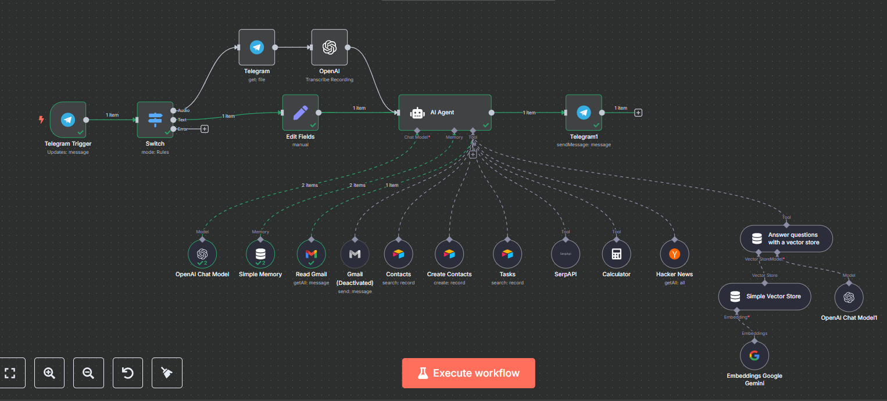

# 🧠 Ultimate AI Assistant (n8n Workflow)

> A voice- and text-powered multi-tool assistant running on Telegram with the intelligence of GPT and the versatility of 10+ tools — this is your second brain, in the cloud.

---

## 📌 What It Does

This AI agent can:
- 🗣 Understand **voice or text input** from Telegram
- 🧾 Read and **respond to emails**
- 👥 Search and **manage your contacts**
- ✅ Track your **to-dos**
- 🧮 Solve math problems
- 🧠 **Answer questions** using a custom vector store (Gemini + GPT)
- 🔍 **Scrape the web** (via SerpAPI)
- 📰 Fetch **Hacker News** headlines
- 🧩 and more — all by typing or speaking

---

## 🧩 Components

### 📲 Telegram I/O
- Trigger via Telegram bot
- Smart Switch handles audio vs. text
- Sends responses back via Telegram

### 🧠 AI Agent (Core Engine)
- Powered by **OpenAI Chat Model**
- Memory via **Simple Memory Node**
- Responds using context + tools

### 🧰 Connected Tools
| Tool            | Purpose                        |
|-----------------|--------------------------------|
| Gmail           | Read emails                    |
| Contacts        | Search existing contacts       |
| Create Contacts | Add new ones                   |
| Tasks           | Task management                |
| Calculator      | Math problem solving           |
| Hacker News     | Tech news fetcher              |
| SerpAPI         | Web scraping/search            |
| Google Sheets   | Optional data source/logs      |

### 🔍 Vector Store QA System
- Ask anything you've stored previously
- Embeddings powered by **Google Gemini**
- Retrieval + answers via OpenAI Chat + RAG

---

## 🖼 Workflow Preview

---

## 💡 Use Cases
- Personal CRM 📇
- Email triage assistant 📬
- Task automation and planning ✅
- Voice-to-AI commands for daily queries 🎙
- Your own ChatGPT+Google+Zapier hybrid bot 🤯

---

## ⚙️ Tech Stack
- [x] n8n
- [x] OpenAI (ChatGPT)
- [x] Google Gemini (Embeddings)
- [x] Telegram Bot API
- [x] Gmail API
- [x] Google Sheets
- [x] SerpAPI
- [x] Vector Store (RAG)

---

## 🧠 Bonus
You can easily extend this by adding:
- WhatsApp triggers
- Calendar integration
- Notion as memory backend
- Custom personas for different chat styles

---

## 🚀 Getting Started

1. Import the `.json` file into n8n.
2. Set up Telegram + Gmail + OpenAI credentials.
3. Run it, message your bot — and be amazed.

---

## 🏆 Why It Stands Out

This isn't just another chatbot. This is:
- 🔌 Multi-modal (voice + text)
- 🧠 Context-aware
- 🧰 Tool-augmented
- 🧠 Memory-powered
- 🔎 Vector store RAG-ready

---
